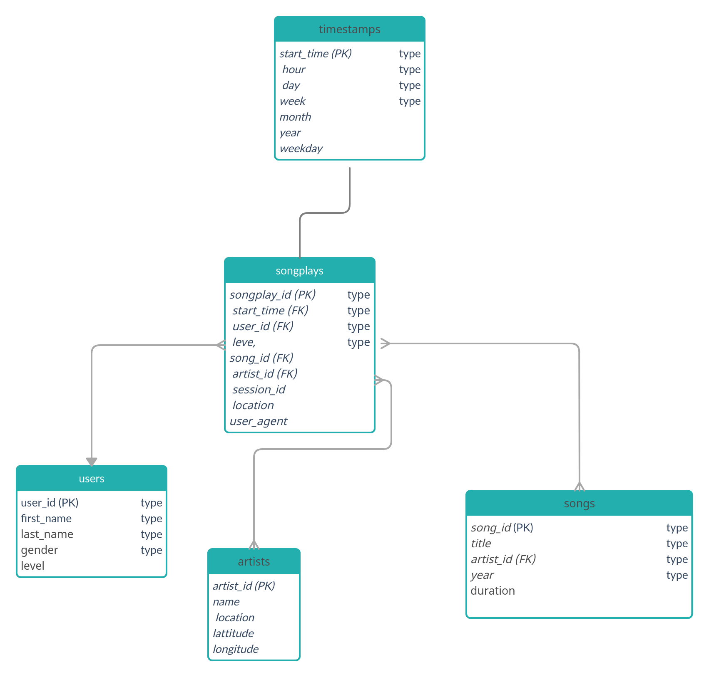

# Sparkify Datalake

This project creates a database of songs and of user activity on the Sparkify streaming app. It arranges the raw information in a star-schema database centered on song plays. The project is emplemented in Pyspark, so that tables can be extracted on AWS EMR (Elastic Map Reduce) to handle efficiently large databases. 

# Database structure

To simplify the database queries, we choose to follow a star design. The database thus contains a fact table, **songlays**, which contains information about each song played by users through Sparkify streaming app. The database also contains the following dimension tables :
- **users** : contains information about Sparkify users
- **songs** : contains song information
- **artists** : contains information about the songs' artists
- **time** : contains information about the playtime of songs through the app.

Sparkify analytics team is particularly interested in knowing what songs users are listening to. The **songplays** table is what is hence of interest to them, and is constantly updated as log data is retrieved from the streaming app. It is thus a fact table. The other tables gives more detail information about some elements of the fact table (i.e. users, songs, artist, and playtime). These are thus dimension tables.

Since there are very few users (102) compared to the total number of songs and songplays (around 10000 each), we use a DIST ALL strategy for the user table. For the other tables, we use `song_id` as a sortkey and distkey for tables `songs` and `songplays`. For `timestamps` and `artists` we use the primary keys to sort and distribute the tables. 

# Installation

## Prerequisites

This project uses python3 and pyspark

## AWS Elastic Map Reduce (EMR) cluster
This project runs on a [AWS EMR cluster](https://aws.amazon.com/emr/). Please follow instructions on [Udacity's EMR cluster tutorial](https://classroom.udacity.com/nanodegrees/nd027/parts/19ef4e55-151f-4510-8b5c-cb590ac52df2/modules/f268ecf3-99fa-4f44-8587-dfa0945b8a7f/lessons/f14bb167-fee8-4a4b-94d3-9ca7fcbabe77/concepts/28c36c65-466e-4b4e-af99-1fc86f90e02f)
To configure correctly pyspark, you have to set the following variables :
`
export SPARK_HOME=/usr/lib/spark
export PYTHONPATH=$SPARK_HOME/python/lib/py4j-src.zip:$PYTHONPATH
export PYTHONPATH=$SPARK_HOME/python:$SPARK_HOME/python/build:$PYTHONPATH
`

Alternatively, these variables can be set automatically with a bootstrap script when launching the EMR cluster (script `EMR_bootstrap.sh`)

To enable access to S3, you have to set a file `dl.cfg` with your AWS access key from [AWS security credentials](https://console.aws.amazon.com/iam/home?region=us-west-2#/security_credentials). We have provided you with a template file `dl_template.cfg`

**__BE CAREFUL TO KEEP dl.cfg SECRET !!! IN PARTICULAR, DON'T PUT IT IN A PUBLIC REPOSITORY.__**

## Data
The data used to populate the database is stored in S3 buckets :
`s3://udacity-dend/song_data`

`s3://udacity-dend/log_data`

## How to run the code

To create and populate the sparkifydb database, open a terminal and run 

 `python etl.py --out output_directory`
 
 `output_directory` may be HDFS or S3, for instance :
 
 `python etl.py --out s3a://mybucket/sparkify/`
 
 `python etl.py --out hdfs:///user/sparkify/`
    

### Example queries
The star database design makes the database queries easy. For instance, if the analytics teams want to know what songs in the database have been played through the app, they can issue a simple sql query. 
Queries may be issued in SQL, or in pyspark 'panda-like' query language. Exemples of queries on the database in pyspark are given in `example_queries.ipynb`

# Changelog

# v1.0
First version submitted to Udacity platform.

# v1.1
Add docstrings to python functions